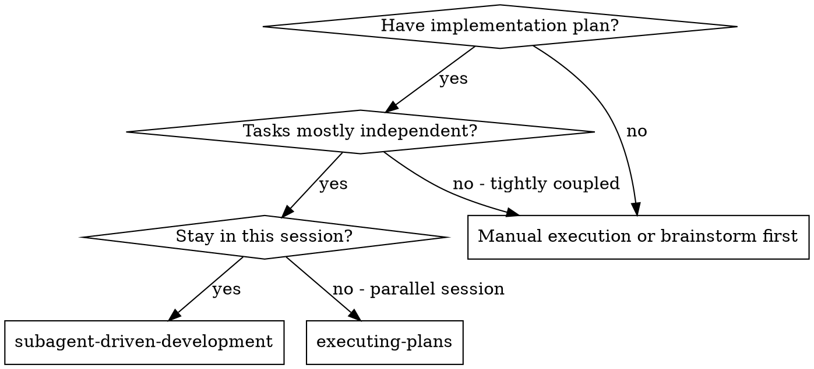
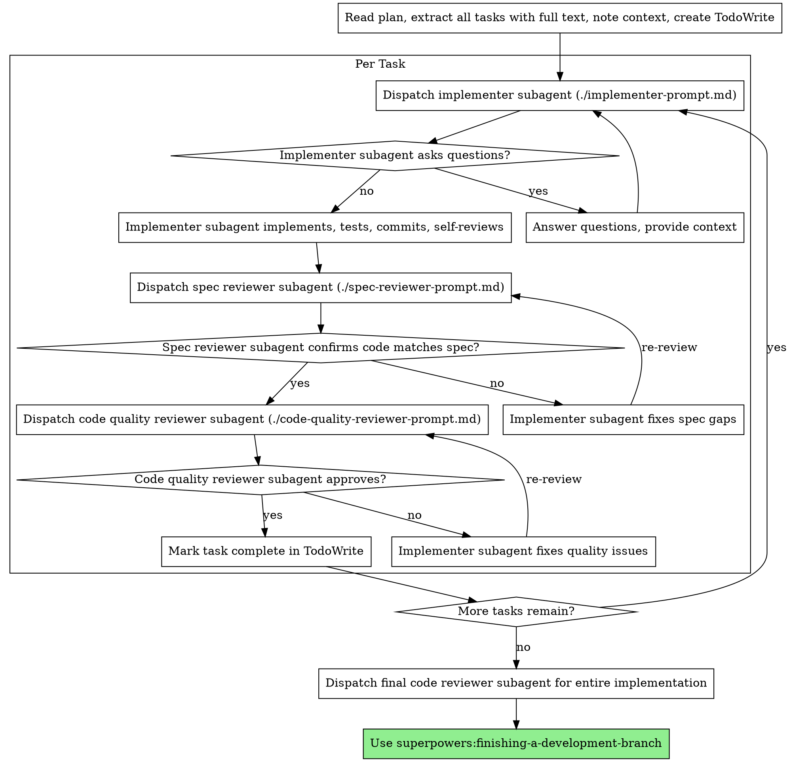

# Subagent-Driven Development

Execute plan by dispatching fresh subagent per task, with two-stage review after each: spec compliance review first, then code quality review.

**Why subagents:** You delegate tasks to specialized agents with isolated context. By precisely crafting their instructions and context, you ensure they stay focused and succeed at their task. They should never inherit your session's context or history. You construct exactly what they need. This also preserves your own context for coordination work.

**Core principle:** Fresh subagent per task + two-stage review (spec then quality) = high quality, fast iteration

## When to Use

**vs. Executing Plans (parallel session):**

- Same session, no context switch
- Fresh subagent per task, no context pollution
- Two-stage review after each task: spec compliance first, then code quality
- Faster iteration, no human-in-loop between tasks

## The Process

## Model Selection

Use the least powerful model that can handle each role to conserve cost and increase speed.

**Mechanical implementation tasks** (isolated functions, clear specs, 1-2 files): use a fast, cheap model.

**Integration and judgment tasks** (multi-file coordination, pattern matching, debugging): use a standard model.

**Architecture, design, and review tasks**: use the most capable available model.

**Task complexity signals:**

- Touches 1-2 files with a complete spec: cheap model
- Touches multiple files with integration concerns: standard model
- Requires design judgment or broad codebase understanding: most capable model

## Handling Implementer Status

Implementer subagents report one of four statuses. Handle each appropriately:

**DONE:** Proceed to spec compliance review.

**DONE_WITH_CONCERNS:** The implementer completed the work but flagged doubts. Read the concerns before proceeding. If the concerns are about correctness or scope, address them before review. If they are observations, note them and proceed to review.

**NEEDS_CONTEXT:** The implementer needs information that was not provided. Provide the missing context and re-dispatch.

**BLOCKED:** The implementer cannot complete the task. Assess the blocker:

1. If it is a context problem, provide more context and re-dispatch with the same model
2. If the task requires more reasoning, re-dispatch with a more capable model
3. If the task is too large, break it into smaller pieces
4. If the plan itself is wrong, escalate to the human

Never ignore an escalation or force the same model to retry without changes.

## Prompt Templates

- `./implementer-prompt.md` - Dispatch implementer subagent
- `./spec-reviewer-prompt.md` - Dispatch spec compliance reviewer subagent
- `./code-quality-reviewer-prompt.md` - Dispatch code quality reviewer subagent

## Advantages

**vs. Manual execution:**

- Subagents follow TDD naturally
- Fresh context per task
- Parallel-safe
- Subagent can ask questions before and during work

**vs. Executing Plans:**

- Same session
- Continuous progress
- Review checkpoints automatic

## Red Flags

Never:

- Start implementation on main/master branch without explicit user consent
- Skip reviews
- Proceed with unfixed issues
- Dispatch multiple implementation subagents in parallel
- Make subagent read the plan file directly
- Ignore subagent questions
- Accept "close enough" on spec compliance
- Start code quality review before spec compliance is approved

## Integration

**Required workflow skills:**

- `superpowers:using-git-worktrees` - Set up isolated workspace before starting
- `superpowers:writing-plans` - Creates the plan this skill executes
- `superpowers:requesting-code-review` - Code review template for reviewer subagents
- `superpowers:finishing-a-development-branch` - Complete development after all tasks

**Subagents should use:**

- `superpowers:test-driven-development` - Follow TDD for each task

**Alternative workflow:**

- `superpowers:executing-plans` - Use for parallel session instead of same-session execution
